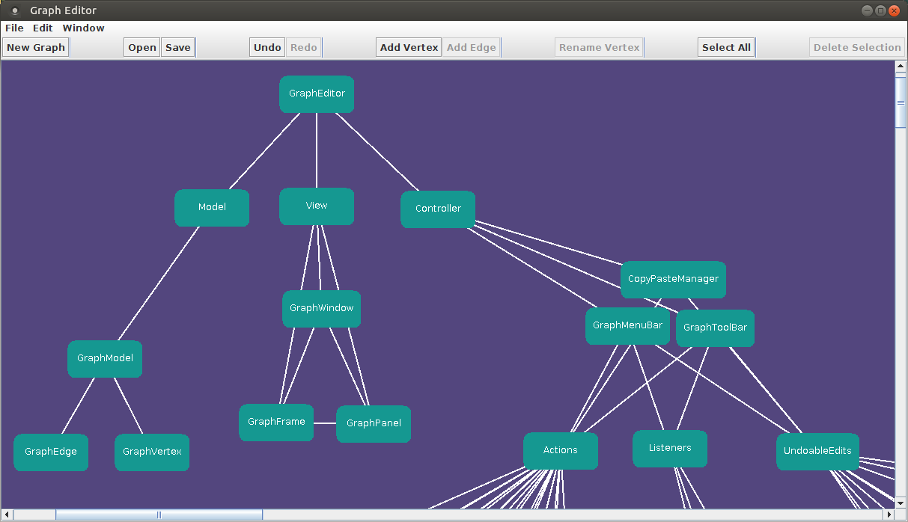
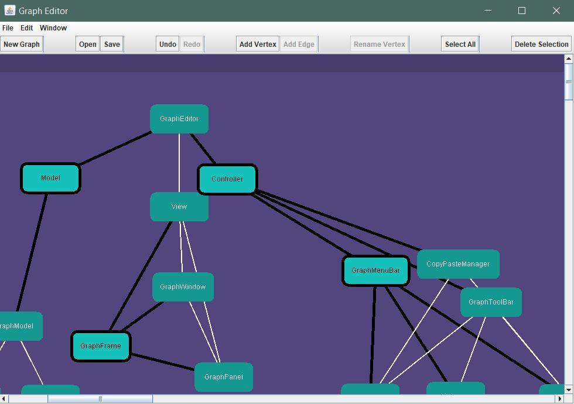
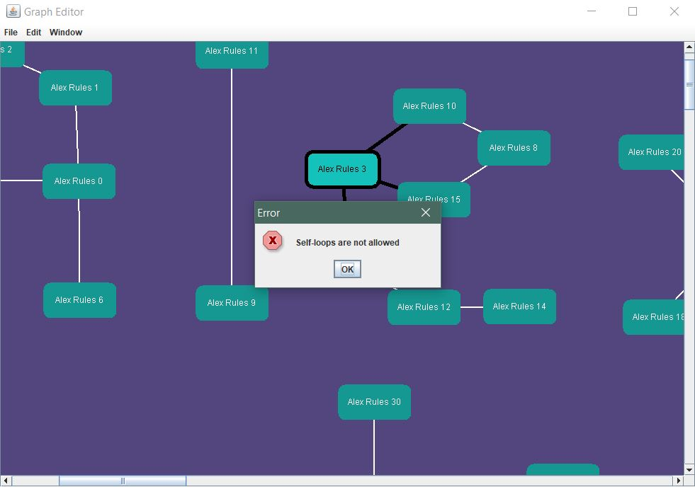

# Java MVC Graph Editor

**Final lab project for the Object Oriented Programming course.**

The task at hand is to create an undirected graph editor with a graphical user interface in Java. It should be designed using Swing and Java IO, with the MVC (Model-View-Controller) architectural pattern kept in mind. The MVC approach is important in order to keep the reasonably complex code maintainable.

A graph is described as a composition of vertices and edges. A vertex is represented by a rectangle, with its own name, size and location. An edge is represented by a line that connects one vertex to another. The pair is unordered in this case as the graph is undirected.

Using the keyboard and/or mouse the user should be able to edit graphs as well as save and load them. The input behaviour should be keyboard/mouse signals received from the user, which should in turn activate actions when detected. The output behaviour should emerge from the activated actions and result in observable changes in the graph.

In addition to that, copy/cut/paste and undo/redo funcionalities are also implemented.

The assignment report is available at [docs/report/Graph_Editor_Final_Assignment_Report.pdf](https://github.com/AndresSalinas97/Java-MVC-Graph-Editor/blob/master/docs/report/Graph_Editor_Final_Assignment_Report.pdf).

## Authors

* Andrés Salinas Lima

* [Russell Sammut-Bonnici](https://github.com/RussellSB)

## Screenshots

